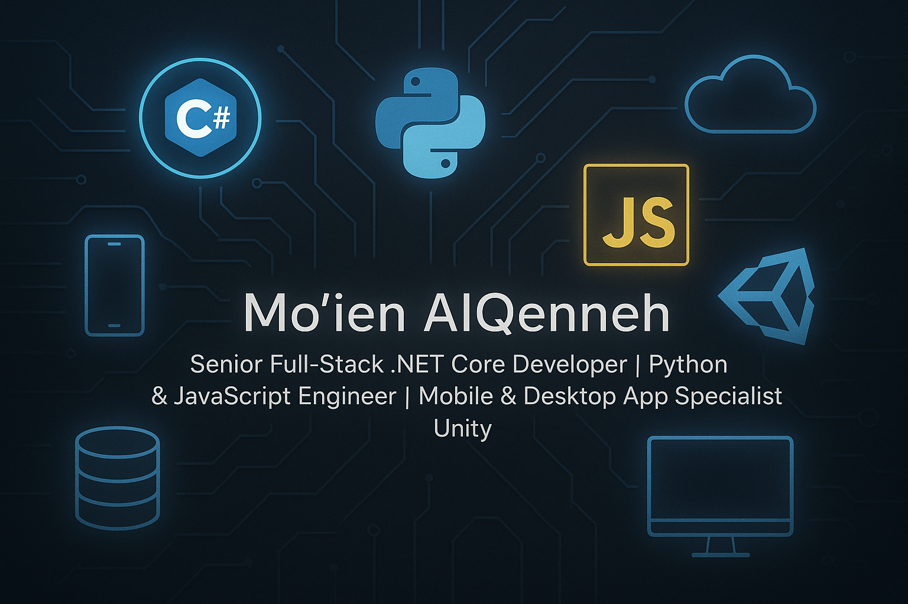

  

# 👋 Hi, I'm Mo'ien AlQenneh

🎯 **Senior Software Engineer | .NET Core Expert | Backend Specialist**

Senior Full-Stack Developer with 9+ years of experience building robust enterprise applications using **.NET Core**, **Python, and JavaScript**. Proven expertise in mobile development with **Flutter**, desktop applications using **C# and SQL**, and interactive experiences with **Unity**. Passionate about clean architecture, scalable systems, and delivering high-performance solutions across web, mobile, and desktop platforms.

## 💡 What I Do

- 🔧 **.NET Core Development**: Building robust backend services, RESTful APIs, and enterprise applications with a focus on performance, clean architecture, and scalability.
- ☕ **Java Engineering**: Backend development with Spring Boot and modern Java frameworks.
- 🧠 **Python Engineering**: Leveraging Python for data processing, automation, and fast API development using FastAPI and Django.
- 🌐 **JavaScript Expertise**: Creating interactive frontends and integrating full-stack solutions with modern JavaScript frameworks (React, Next.js, Angular).
- 📱 **Mobile Development**: Building cross-platform mobile apps using Flutter (Dart) and Kotlin (Android native).
- 🎮 **Unity Game Dev**: Creating 2D/3D interactive desktop and mobile games using C# and Unity Engine.
- ☁️ **Cloud & DevOps**: Deploying applications to **Azure** and **AWS**, containerizing with **Docker**, and automating workflows with **CI/CD pipelines**.
- 📈 **System Design & Architecture**: Designing systems that solve complex business problems with maintainability and reliability in mind.

## 🔨 Tech Stack

- **Backend:** C#(.NET Core), Java, Python (Django, FastAPI), Node.js  
- **Frontend:** React, Next.js, Angular, JavaScript (ES6+), TypeScript, Three.js, GSAP
- **Mobile:** Flutter, Kotlin (Jetpack Compose), API integration
- **Databases:** SQL Server, PostgreSQL, MongoDB, SQLite.
- **Messaging & Caching:** RabbitMQ, Kafka, Redis Pub/Sub. 
- **DevOps & Cloud:** Azure, AWS, Docker, Kubernetes, Azure DevOps, GitHub Actions  

## 🚀 Project-Based Experience Highlights

- **Microservices Architecture in .NET Core** with Ocelot, RabbitMQ, Docker  
- **CQRS + DDD** Modulith with Outbox Pattern  
- **Clean Architecture** using SOLID & TDD with NUnit/Moq  
- **eCommerce Platform** with .NET 7, Azure DevOps CI/CD, Kubernetes (AKS)  
- **Cloud-Native Apps** using Istio, GitHub Actions, ArgoCD  
- **Next.js + .NET Full Stack SaaS** with JWT Auth & Docker Compose  

### 📈 GitHub Stats

### 🔗 Connect With Me
- 📧 moienalqenneh@gmail.com
- 🌐 [LinkedIn](https://www.linkedin.com/in/moien-qenneh-8862a938/)
  
  ---

*Always learning. Always building. Always optimizing.*
