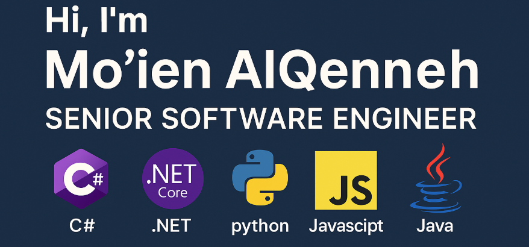

  

# 👋 Hi, I'm Mo'ien AlQenneh

🎯 **Senior Software Engineer | .NET Core Expert | Backend Specialist**

I am a passionate and results-driven software engineer with deep expertise in **C# and .NET Core**, and strong working knowledge of **Python** and **JavaScript**. With over 9 years of experience, I design and develop scalable, high-performance backend systems and APIs that power enterprise-grade applications.

## 💡 What I Do

- 🔧 **.NET Core Development**: Building robust backend services, RESTful APIs, and enterprise applications with a focus on performance, clean architecture, and scalability.
- 🧠 **Python Engineering**: Leveraging Python for data processing, automation, and fast API development using FastAPI and Django.
- 🌐 **JavaScript Expertise**: Creating interactive frontends and integrating full-stack solutions with modern JavaScript frameworks.
- ☁️ **Cloud & DevOps**: Deploying applications to **Azure** and **AWS**, containerizing with **Docker**, and automating workflows with **CI/CD pipelines**.
- 📈 **System Design & Architecture**: Designing systems that solve complex business problems with maintainability and reliability in mind.

## 🔨 Tech Stack

- **Languages**: C#, Python, JavaScript, SQL
- **Frameworks**: .NET Core, ASP.NET, Django, FastAPI, React, Angular
- **Databases**: MS SQL Server, PostgreSQL, MongoDB
- **Tools**: Git, Docker, Azure DevOps, Postman, Power BI

### 📈 GitHub Stats

### 🔗 Connect With Me
- 📧 moienalqenneh@gmail.com
- 🌐 [LinkedIn](https://www.linkedin.com/in/moien-qenneh-8862a938/)
  
  ---

*Always learning. Always building. Always optimizing.*
